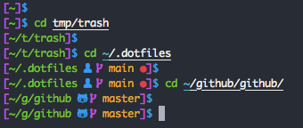

# @lildude's dotfiles

These are my dotfiles. I've borrowed many ideas from many different locations to create my ideal setup.

This current implementation is managed using [chezmoi](https://chezmoi.io/) and is mostly built upon [ZSH for Humans](https://github.com/romkatv/zsh4humans).

## Installation

### Direct from this repo

Download and install 1Password CLI from <https://1password.com/downloads/command-line/> and then run:
  
```console
$ xcode-select --install
$ eval $(op signin my.1password.com <email>) 
$ sh -c "$(curl -fsLS git.io/chezmoi)" -- -b ~/.local/bin init --apply lildude
```

### On Codespaces or VS Code Remote Containers

Codespaces and VS Code Remote Containers (thanks to my settings) automatically clone the dotfiles repo and runs `script/install` automatically when the container is started.

## My Prompt



## Slack Theme

Cos I need somewhere to store it

`#282A36`,`#44475A`,`#44475A`,`#8BE9FD`,`#6272A4`,`#FFFFFF`,`#50FA7B`,`#FF5555`,`#44475A`,`#FFFFFF`